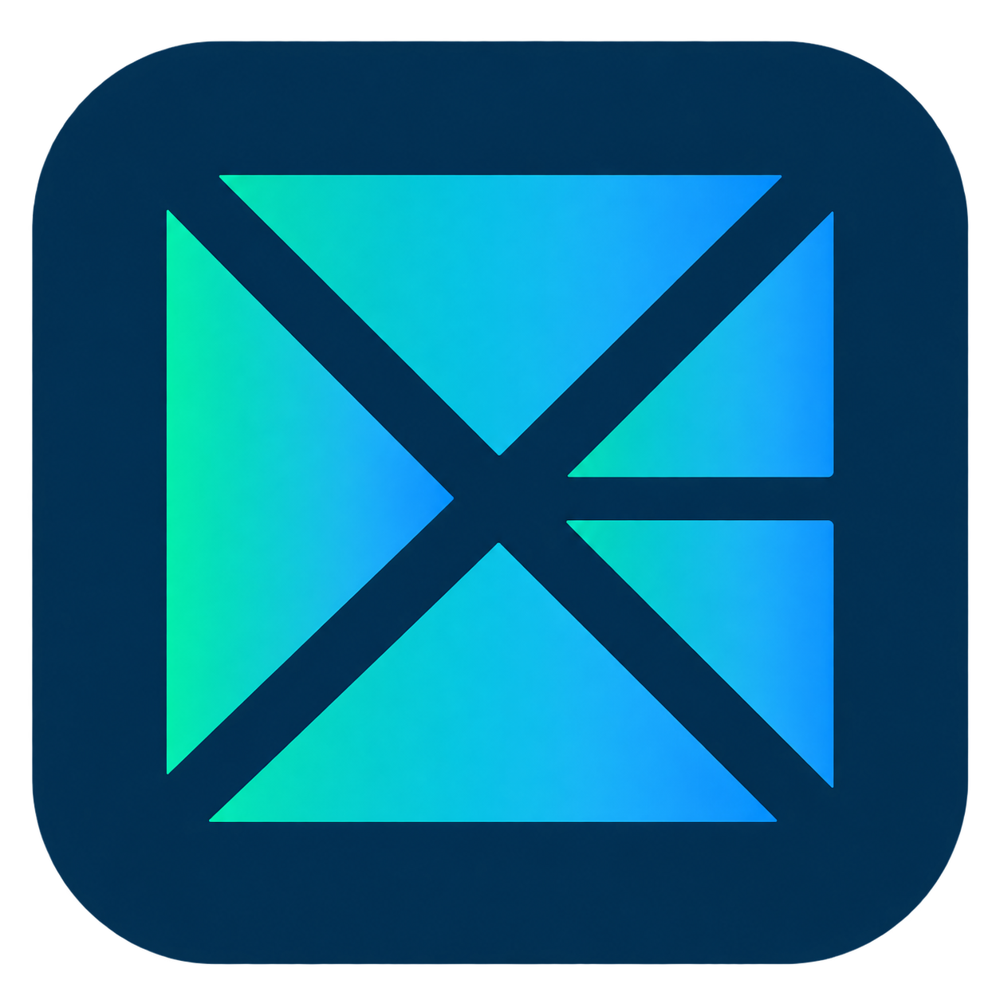

# Xenon Browser



**An open-source Windows browser for people and MCP agents working together.**

Xenon combines a Windows browser powered by Chromium with tools that let external agents inspect pages, interact with controls, and hand off a live tab. You choose which clients can connect, which workspaces they can use, and which saved accounts or local files they may access.

**Current release: 0.1.0-alpha.12 · Windows x64 · unsigned alpha.** A per-user installer with a folder chooser and in-browser update checks are available. Installation remains a human decision. The included tests exercise synthetic websites and specific native workflows; they do not establish universal website compatibility or an independent security audit.

[Download the Windows release](https://github.com/Xero-05/xenon-browser/releases/tag/v0.1.0-alpha.12) · [Get started](docs/GETTING_STARTED.md) · [User guide](docs/USER_GUIDE.md) · [Agent instructions](docs/AGENT_GUIDE.md) · [MCP reference](docs/MCP.md)

This release adds the native shell, reorganized Controls and client policies described below. See [release notes](docs/RELEASE_NOTES.md) and [validation scope](docs/TESTING.md).

## What Xenon does

- **Use your own MCP client.** Connect a local host that supports MCP over stdio. Xenon needs no model API key or built-in AI service.
- **Keep workspaces separate.** Each has its own cookies and local storage. Share an existing workspace deliberately when agents should use the same website session.
- **Hand off live work.** Ownership changes leave the existing tab, form state and connections in place. The ownership commit sends no command to Chromium.
- **Work alongside an agent.** An agent owns tabs it creates. Your page input pauses its actions without taking ownership away; after you finish, it must obtain fresh evidence before continuing.
- **Give agents bounded page evidence.** Structured observations use rendered text in the current viewport and report omissions. Screenshots support visual tasks. Hidden metadata is withheld, while all website content remains untrusted.
- **Keep vault passwords out of MCP.** Save or import accounts into a Windows DPAPI-encrypted vault. Humans can use native fill-only prompts; agents use opaque account IDs under explicit grants for the exact HTTPS origin.
- **Approve file access.** Native file and folder grants supply scoped upload handles. Agents do not receive an unrestricted filesystem or shell.

The browser uses CEF's sandboxed Chrome runtime, a native C++ broker and an external TypeScript MCP adapter. Its native shell has grouped vertical tabs, saved monochrome themes, readable ownership borders and an agent cursor. Controls separates clients, workspaces and passwords; client policies cap each workspace's permissions.

## Start here

1. Download the **unsigned Windows installer** and its SHA-256 file from the release, verify the checksum, and run setup. A fresh installation lets you choose an empty, writable program folder on a local fixed drive; later updates reuse it. See [Get started](docs/GETTING_STARTED.md) for the exact steps.
2. Open **Xenon Browser** from the Start menu. A fresh launch opens a blank tab.
3. Open **Xenon Controls** with **Ctrl+Shift+X**, the toolbar button, or the **Xenon Controls** webpage context-menu item.
4. Follow [Get started](docs/GETTING_STARTED.md) to pair an MCP client using the included Node runtime.

The portable ZIP remains available: verify its checksum, extract the **whole archive**, and run `Xenon.exe` from that folder. Keep the executable, DLLs, resources, locales and adapter together.

Closing Xenon does not sign you out of websites: persistent workspaces retain cookies, including session cookies. **Restore last session** is an explicit action and reloads eligible saved URLs under human ownership.

## Know the alpha's boundaries

Xenon supports external **local stdio MCP hosts**; remote-only hosts need another transport. Visual tasks need an image-capable client/model. There is no built-in model, cloud sync or signed installer, and no guarantee of proprietary DRM or arbitrary extension compatibility. Update checks and downloads are available in Xenon Controls; updates never silently close the browser or replace a running session.

Xenon supplies native navigation and menus for find, zoom, bookmarks, history, downloads, printing/PDF and site permissions. Engine credits and licenses remain accessible through About and Third-party Notices. Xenon's native vault manages passwords. The complete physical menu/dialog, high-contrast and multiple-DPI acceptance matrix remains unfinished; see [test scope](docs/TESTING.md).

Saved-account support covers a bounded set of HTTPS forms. MFA, passkeys, CAPTCHA, embedded login widgets and unusual flows need human handling. Automatic Save/Update and human autofill have renderer/native fixture coverage, but the complete human credential-prompt workflow and real-site compatibility remain manual acceptance work. See the [user guide](docs/USER_GUIDE.md#saved-accounts) and [test scope](docs/TESTING.md).

Filtering hidden text reduces one source of misleading evidence; it cannot make an LLM immune to prompt injection. Websites can display private information or malicious instructions in visible text and images. Sharing a workspace exposes its existing website sessions to the permitted client, and separate profiles do not prevent conflicting changes to the same remote account or document. Read the [security boundaries](docs/SECURITY.md) before granting access to sensitive sessions.

## Build and contribute

With the Windows C++ build tools, CMake, Node 24, Git and 7-Zip installed (see [prerequisites](docs/BUILD.md)):

```powershell
./scripts/bootstrap.ps1
npm.cmd ci
./scripts/build.ps1 -Test
./build/app/Release/Xenon.exe
```

See [build and packaging instructions](docs/BUILD.md), [architecture](docs/ARCHITECTURE.md), [validation records](docs/TESTING.md), [branding](docs/BRANDING.md) and [contributing](CONTRIBUTING.md).

Xenon's source is licensed under [Apache-2.0](LICENSE). CEF, Chromium, Node and other dependencies retain their own licenses; see [third-party notices](THIRD_PARTY_NOTICES.md). Report vulnerabilities through the [private security channel](SECURITY.md).
