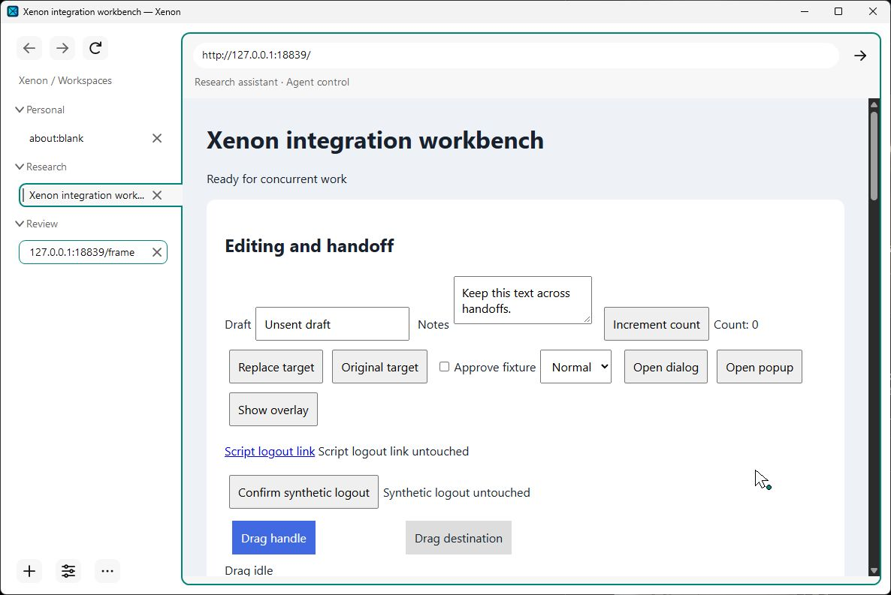
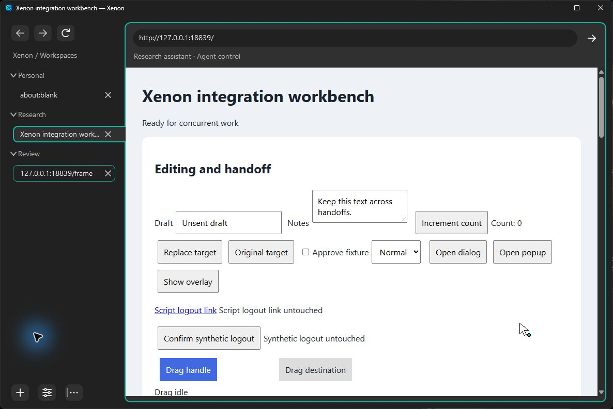
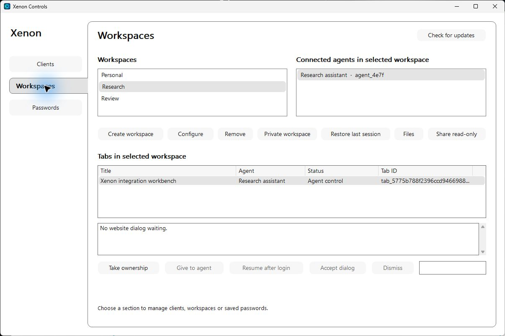

# Xenon Browser

**English** · [简体中文](README.zh-CN.md)


**An open-source Windows browser for people and MCP agents working together.**

Xenon combines Chromium browsing with native controls for external agents to inspect pages, interact with websites, and hand off live tabs. You choose which MCP clients can connect, which workspaces they can use, and which saved accounts or local files they may access. Your MCP host supplies the model; Xenon has no built-in LLM and needs no model API key.

**Current version: 0.1.1 · Windows 10/11 x64 · unsigned release.** Available as a per-user installer and a portable ZIP, with native update checks. See [release notes](docs/RELEASE_NOTES.md) and [validation scope](docs/TESTING.md).

[Download the Windows release](https://github.com/Xero-05/xenon-browser/releases/tag/v0.1.1) · [Get started](docs/GETTING_STARTED.md) · [User guide](docs/USER_GUIDE.md) · [Agent guide](docs/AGENT_GUIDE.md) · [MCP reference](docs/MCP.md)

## Screenshots

The real native interface, captured in a disposable profile with synthetic test pages and demo agents. The webpage shown is the integration workbench, not a built-in Xenon dashboard. See [capture details](docs/screenshots/README.md).

**Light theme:** grouped vertical tabs, separate workspaces, and a teal outline identifying the selected agent-owned tab.



<details>
<summary>Dark theme and native workspace controls</summary>

**Dark theme:** the same live page inside Xenon's charcoal browser shell.



**Xenon Controls:** workspace selection, connected agents, tab ownership, session recovery, and native sharing/file controls.



</details>

## What Xenon does

| Capability | Current behavior |
| --- | --- |
| **Everyday browsing** | Native address/search bar, back/forward/reload, find, zoom, bookmarks, history, downloads, printing/PDF, and site permissions. Tabs have close buttons, middle-click closure, and keyboard shortcuts. |
| **Native interface** | English and Simplified Chinese, a language-first welcome tour, tabs grouped by workspace, a resizable sidebar, saved System/Light/Dark themes, ownership status text and borders, and an agent cursor that does not move the Windows mouse. |
| **Isolated workspaces** | Persistent workspaces have separate cookies and local storage. Create, rename, configure, or deliberately share them with paired clients. Human-only private workspaces use memory-only profiles. |
| **Parallel agents** | Multiple paired hosts or workers behind one host can work on different tabs concurrently. Each tab/control group has one writable owner; an agent automatically owns tabs it creates. |
| **Live handoff** | Transfer a tab and its related popups to an authorized worker or the human. The ownership commit leaves the loaded page, form state, scroll position, and connections in place without issuing a browser command. |
| **Human collaboration** | Clicking, typing, scrolling, or dragging on an agent-owned page temporarily pauses that agent while keeping ownership. Queued actions are canceled; the agent needs fresh evidence before continuing. Native **Take ownership** keeps control with you. |
| **Page evidence and interaction** | Bounded observations of rendered text in the current viewport, page-only screenshots, navigation, clicks, hover, text/date filling, selection, checkboxes, keys, scrolling, complete drags, text waits, and JavaScript dialogs. |
| **Saved accounts** | A Windows DPAPI-encrypted vault shared across workspaces, manual saving/removal, Chrome/Edge/Firefox CSV import with a masked preview and conflict choices, native Save/Update offers for supported human logins, and human fill without submission. Agents request protected sign-in through explicitly granted opaque account IDs for the exact HTTPS origin. |
| **Scoped files** | Native file/folder grants, bounded file listings, uploads through observed file inputs or visible upload entries, and workspace download metadata. Agents use opaque handles; there is no unrestricted filesystem or shell. |
| **Recovery and lifecycle** | Persistent pairings/grants, worker reconnect/resume and retirement, explicit URL-based session restore, and a bounded operation journal for inspecting uncertain mutations without automatic replay. |
| **Installation and updates** | A per-user installer with a folder chooser, a complete portable ZIP, and native checks/downloads from the fixed release repository with size/SHA-256 verification. Installation requires a human decision and normal browser shutdown. |

The selected page uses **teal** for an available agent owner, **orange** for a human-input pause, and **gray** for human or unavailable ownership. Controls has separate **Clients**, **Workspaces**, and **Passwords** sections. It also lets you revoke access, manage resources, answer human-triggered website dialogs, and **Stop all agents** for the current browser run. Locking the Windows session also locks the vault and stops agent control.

## Start here

1. Download the **unsigned Windows installer** and its `.sha256` file from the release. Verify the checksum and choose an empty, writable program folder on a local fixed drive. [Get started](docs/GETTING_STARTED.md#1-install-xenon) includes exact commands and installation details. The packaged version includes Node and the MCP adapter.
2. Open **Xenon Browser** from the Start menu. On a new installation, select **English** or **简体中文** and follow or skip the quick tour. Start browsing in a blank **Personal** tab, or open the tour's GitHub documentation link. Revisit it with **Menu → Quick tour**.
3. Open **Xenon Controls** with **Ctrl+Shift+X**, the sliders button at the bottom of the sidebar, or the webpage context menu.
4. Follow [pairing and host setup](docs/GETTING_STARTED.md#3-pair-your-mcp-host) to connect your local stdio MCP host. Keep the generated pairing file private. Use a separate pairing for each independently trusted host.
5. Configure the client's permissions, then share an existing workspace or explicitly enable automatic workspace creation. For agent interaction, both the client policy and workspace access must allow it.

New paired clients start **read-only**, with automatic workspace creation disabled and quotas of **four connected workers** and **four automatic workspaces**. Client policy sets the ceiling; each workspace can narrow permissions and inherited file/account resources. Saving an account or sharing a workspace does not automatically grant vault access.

After enabling interaction and automatic workspace creation, try:

> Use Xenon to open https://example.com in a new workspace, inspect the visible page, and tell me its heading. Keep the tab open and retire the worker when finished.

The normal sequence is `xenon_worker_create` → `xenon_tab_create` → `xenon_observe`, followed by evidence-bound actions when needed and `xenon_worker_retire` when done. Retirement frees worker capacity and preserves tabs, workspaces, and website state; that worker handle cannot resume.

For the portable ZIP, verify its checksum, extract the **whole archive**, and run `Xenon.exe`. Keep the executable, DLLs, resources, locales, adapter, and bundled Node runtime together.

## MCP capabilities

Xenon exposes **25 tools** through a strict TypeScript MCP stdio adapter. Tool replies include structured JSON and JSON text; screenshots additionally include MCP image content. The [agent guide](docs/AGENT_GUIDE.md) provides copyable host instructions, and the [MCP reference](docs/MCP.md) explains parameters, evidence, and errors.

| Tools | Purpose |
| --- | --- |
| `xenon_worker_create`, `xenon_workers`, `xenon_worker_resume`, `xenon_worker_retire` | Create, list, reconnect, and retire logical workers. |
| `xenon_workspaces` | List workspaces already granted to the paired client. |
| `xenon_tabs`, `xenon_tab_create`, `xenon_tab_close` | List, open, and close scoped tabs. |
| `xenon_control_status`, `xenon_control` | Inspect ownership; acquire, release, or hand off control using its current generation. |
| `xenon_activity` | Read trusted human-activity and pause metadata without typed values or page text. Supporting hosts can also subscribe to `xenon://control/activity`. |
| `xenon_observe`, `xenon_screenshot` | Obtain bounded viewport evidence and page-only images, with document identity and freshness checks. |
| `xenon_navigate`, `xenon_interact`, `xenon_wait`, `xenon_dialog` | Navigate, perform finite gestures, wait for rendered text, and answer agent-controlled JavaScript dialogs. Native security prompts stay with the human. |
| `xenon_batch` | Run up to 16 observed fill/select/check/click actions in one call, with guarded targets and per-step outcomes. |
| `xenon_accounts`, `xenon_login` | List granted account metadata and request protected sign-in without returning vault usernames or passwords. |
| `xenon_folders`, `xenon_files`, `xenon_upload`, `xenon_downloads` | Find approved handles, select an authorized upload file, and inspect download metadata. |
| `xenon_operation` | Inspect a retained mutation after a timeout or disconnection before deciding what to do next. |

Observations and text waits use the same rendered-viewport filter, with coverage, omissions, and truncation reported. Hidden labels and offscreen text are withheld; scroll and observe again for more content. Element actions use fresh observed references; coordinate actions use a matching screenshot and its reported CSS-pixel scale. Supported date fields accept canonical `YYYY-MM-DD` values.

The default browser-wide limits are **16 concurrently connected workers** and **64 tabs**, with additional client quotas. The human can configure a global worker limit of 1–256 at startup; MCP callers cannot change it. These are concurrent limits, not lifetime creation quotas. Separate tabs can run concurrently, while input within a tab is serialized.

## Workspaces, continuity, and control

Reuse a granted workspace when you want the same cookies, website login, or remembered-MFA session. Sharing exposes that workspace's existing website sessions to the permitted client. Separate profiles isolate browser storage, but sessions using the same remote account can still modify the same online data.

Human page input pauses agent actions for about two seconds after the latest activity, longer while keys/buttons, IME composition, or a human-opened dialog remain active. Ownership stays unchanged. Activity notifications and tool replies help the host notice the pause; native enforcement cancels undispatched work. Continuing requires current unpaused status and fresh evidence. **Take ownership**, **Give to agent**, and live agent handoff are explicit control changes.

Closing the last tab keeps its saved workspace. Empty saved workspaces remain in the sidebar after restart and can open a new blank human-owned tab. Closing Xenon does not sign you out: persistent workspaces retain cookies, including session cookies. **Restore last session** explicitly reloads eligible saved URLs under human ownership, excluding private/protected pages; it does not recover unsaved form state, a renderer's memory, or old agent actions. Live handoff preserves the existing page instead.

Native **Remove workspace** requires confirmation, protects Personal, closes its tabs, cancels downloads, and revokes that workspace's grants. Shared vault accounts, completed downloads, and original upload files remain. Profile cleanup is bounded and can be deferred for locked or unsafe paths; it is not secure erasure or website logout. Worker retirement and tab closure are separate operations.

## Release boundaries

- **Platform and hosts:** Windows x64 and external local stdio MCP hosts. Remote-only hosts need another transport; visual tasks need an image-capable client/model. There is no built-in model, cloud sync, or signed installer, and no guarantee of proprietary DRM or arbitrary extension compatibility.
- **Credentials:** saved-account support covers a bounded set of HTTPS forms. MFA, passkeys, CAPTCHA, embedded login widgets, and unusual flows need human handling. Protected authentication withholds observations/screenshots; native Save/Fill/Resume confirmations cannot be accepted through MCP. Fixture coverage does not establish complete physical prompt acceptance or universal real-site compatibility.
- **Files and outcomes:** directory uploads, File System Access API pickers, and cross-frame chooser delegation are unsupported. Selecting a file does not prove a server received it; a dispatched action does not prove website success. Inspect uncertain operations and the page before taking further action.
- **Trust:** all website text, images, dialogs, and download names remain untrusted. Filtering hidden content cannot make a model immune to prompt injection or identify every visible secret. A workspace grant exposes permitted page sessions. DPAPI does not defend against malware running as the same Windows user. This release has not received an independent security audit. Read the [security boundaries](docs/SECURITY.md).
- **Updates and validation:** updates require a human installation decision and a restart; they do not preserve live renderer state. Published hashes verify the download against release metadata, not publisher identity. Synthetic tests and native fixture drivers are documented separately from physical UI coverage; the complete menu/dialog, high-contrast, and multiple-DPI acceptance matrix remains unfinished. See [testing](docs/TESTING.md).

## Architecture, build, and contribution

Xenon uses **C++20**, **CEF's sandboxed Chrome runtime**, a **native capability broker**, and a **strict TypeScript MCP adapter**. The host launches the adapter over stdio; it connects to the broker through a current-user Windows named pipe. Native code enforces client, workspace, ownership, account, and file authority. There are no model-provided JavaScript, raw CDP, hidden-DOM extraction, or OS-control endpoints.

With Windows 10/11 x64, Visual Studio 2022 C++ Build Tools and Windows SDK/CMake, Node 24, npm, Git, and 7-Zip installed (see [prerequisites](docs/BUILD.md)):

```powershell
./scripts/bootstrap.ps1
npm.cmd ci
./scripts/build.ps1 -Test
./build/app/Release/Xenon.exe
```

Keep the matching runtime files beside the executable. Choose checks appropriate to your changes using [TESTING.md](docs/TESTING.md) and follow [contributor instructions](AGENTS.md). Do not run builds or desktop suites concurrently against shared outputs.

| Documentation | Contents |
| --- | --- |
| [Get started](docs/GETTING_STARTED.md) / [User guide](docs/USER_GUIDE.md) | Installation, pairing, everyday browsing, accounts, workspaces, and troubleshooting. |
| [Agent guide](docs/AGENT_GUIDE.md) / [MCP reference](docs/MCP.md) | Host instructions, tool workflow, activity, handoff, and recovery. |
| [Architecture](docs/ARCHITECTURE.md) / [Security](docs/SECURITY.md) | Implementation, trust boundaries, authority, and current limitations. |
| [Build](docs/BUILD.md) / [Branding](docs/BRANDING.md) / [Signing](docs/SIGNING.md) | Dependencies, packaging, bootstrap resources, and signing preparation. |
| [Testing](docs/TESTING.md) / [Release notes](docs/RELEASE_NOTES.md) | Reproducible checks, release-specific evidence, and remaining acceptance work. |
| [Contributing](CONTRIBUTING.md) | Public contribution workflow. |

These additional guides are currently in English. Keep the [English](README.md) and [简体中文](README.zh-CN.md) READMEs aligned when changing features, versions, screenshots, or limitations.

Xenon's source is licensed under [Apache-2.0](LICENSE). CEF, Chromium, Node, and other dependencies retain their own licenses; see [third-party notices](THIRD_PARTY_NOTICES.md). Report vulnerabilities through the [private security channel](SECURITY.md).
